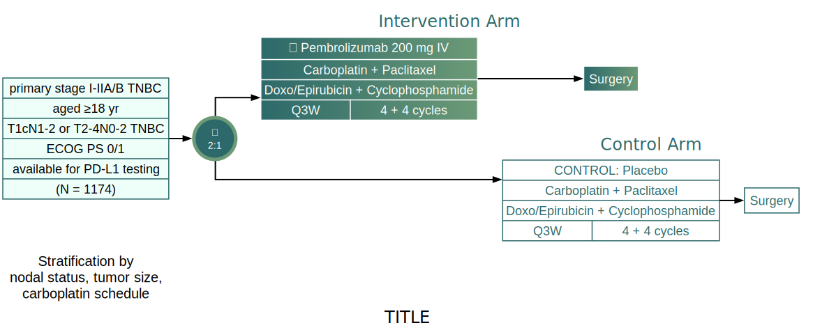

at: [[inbox]]

# Sanford Guide: HBV Treatment

Indications for TreatmentWhen to TreatTreatment RegimensPreventionComments

### Indications for Treatment

- Treatment of Hepatitis B (HBV) infection.
- The following are key indicators: HBeAg status, HBV viral load (HBV DNA), elevated liver enzymes (ALT level), cirrhosis. For HBeAg+ patients treatment is typically deferred for 3-6 months to observe spontaneous seroconversion from HBeAg+ to negative.
- Hepatitis B genome may be present but hard to detect. Only evidence may be presence of HBcAb with negative HBsAg and negative HBsAb. Such patients at risk of reactivation if immunosuppressed for cancer chemotherapy or transplantation. See HBV reactivation for details

### When to Treat

- The following are key indicators: HBeAg status, HBV viral load (HBV DNA), elevated liver enzymes (ALT level), cirrhosis. For HBeAg+ patients treatment is typically deferred for 3-6 months to observe spontaneous seroconversion from HBeAg+ to negative.

| HBeAg Status | HBV DNA
(Viral Load) | ALT | Fibrosis*| Treatment**| Comments |
| --- | --- | --- | ---- | --- | --- |
| Pos | >20,000 | <2x ULN | F0-F2 | Observe | Low efficacy with current Rx; biopsy helpful in determining whether to Rx.  Lean toward Rx if older age or + Family Hx HCC |
| Pos | >20,000 | <2x ULN | F3-F4 | Treat: IFN or NUC | **No IFN if decompensated cirrhosis** |
| Pos | >20,000 | >2x ULN | Any | Treat: IFN or NUC | IFN has higher chance of seroconversion to HBeAg Negative and HBsAg Negative status. |
| Neg | <2000 | <1x ULN | Any | Observe | Might Treat if F4;**No IFN if decompensated cirrhosis.\*\* |
| Neg | 2,000-20,000 | <2x ULN | F0-F2 | Observe |   |
| Neg | 2,000-20,000 | <2x ULN | F3-F4 | Treat: NUC (of IFN) | NUCs favored if HBeAg negative; Treatment duration ill-defined.  Certainly > 1 year, likely chronic Rx (indefinitely) |
| Neg | >20,000 | >2x ULN | Any | Treat: NUC or IFN | NUCs favored if HBeAg negative; Treatment duration chronic /  indefinite |
| References: AASLD HBV Treatment Guidelines (<www.aasld.org>);*Hepatology\* 50:1, 2009.

- Liver Biopsy or fibrosure assay is helpful in determining when and how to treat.
  \*\* Treatment Regimens listed below. |

### Treatment Regimens

- Single drug therapy is usually sufficient; combination therapy used with HIV co-infection.

|                    | Drug/Dose | Comments |
| ------------------ | --------- | -------- |
| Preferred Regimens |

**Pegylated-Interferon-alpha 2a** 180 μg sc once weekly  OR
**Entecavir** 0.5 mg po once daily OR
**Tenofovir alafenamide** (TAF/Vemlidy) 25 mg po once daily

|

PEG-IFN: Treat for 48 weeks.
Entecavir: Do not use Entecavir if Lamivudine resistance present.
Entecavir/Tenofovir:  Treat for at least 24-48 weeks after seroconversion from HBeAg to anti-HBe. Indefinite chronic therapy for HBeAg negative patients. Renal impairment dose adjustments necessary.

|
| Alternative Regimens |

**Lamivudine** 100 mg po once daily OR
**Telbivudine** 600 mg po once daily OR
**Emtricitabine** 200 mg po once daily (investigational) OR
**Adefovir** 10 mg po once daily OR
**Tenofovir disproxil** (TDF) 300 mg po once daily

| These alternative agents are rarely used except in combination. When used, restrict to short term therapy owing to high rates of development of resistance. Not recommended as first-line therapy. Use of Adefovir has mostly been replaced by Tenofovir. |
| Preferred Regimen
for HIV-HBV Co-Infected Patient | **Truvada** (Tenofovir disproxil [TDF] 300 mg + Emtricitabine  200 mg) po once daily + another anti-HIV drug | ALL patients if possible as part of a fully suppressive anti-HIV/anti-HBV regimen.  Continue therapy indefinitely. |

### Prevention

- See Hepatitis B, Vaccine for indications, available products, dosing, and vaccine characteristics for pre-exposure prevention.

### Comments

- The goal of therapy for HBeAg+ patients is seroconversion from positive to negative (but this rarely occurs). For HBeAg negative patients, the goal is suppression of HBV DNA to < 50IU/mL.
- Summary of sustained viral reposne after one year of therapy. Note: low frequency of loss of HBeAg loss.

|                                        | PEG-IFN2a | Lamivudine | Adefovir | Entecavir | Telbivudine | Tenofovir |
| -------------------------------------- | --------- | ---------- | -------- | --------- | ----------- | --------- |
| HBeAg Seroconversion                   | 27%       | 16-21%     | 12%      | 21%       | 22%         | 21%       |
| HBV DNA <50IU/mL                       | 25-63%    | 60-73%     | 51-64%   | 67-90%    | 60-88%      | 80-95%    |
| ALT normalization                      | 39%       | 41-75%     | 48-61%   | 68%       | 60%         | 77%       |
| HBeAg loss                             | 3%        | <1%        | 0        | 2%        | <1%         | 3%        |
| Viral Resistance                       | 0         | 15-30%     | Minimal  | 0         | 6%          | 0         |
| Modified from Hepatology 45:507, 2007. |

- **All patients with HBV infection should be vaccinated against Hepatitis A.  Add link to Hepatitis A, Vaccines**
- **All patients with HBV should be evaluated for presence of Hepatitis D (HDV or Delta) virus infection.**
- Interferon best used in HBeAg+ patients; much higher conversion rates from HBeAg+ to HBeAg- and from HBsAg+ to HBsAg- with IFN compared to nucleoside regimens.
- **IFN therapy** favored in **Genotype A (and B)** patients; and those who have lower HBV DNA, higher ALT, younger age, and women, all have higher seroconversion response rates.
- For those who seroconvert from HBeAg to anti-HBe, if consolidation therapy for one additional year, 20% will sero-revert back to HBeAg+ status within 1 – 3 years.  Ongoing monitoring is required for all patients.
- **NOTE:  Return to active HBV replicative state, including HBsAg sero-reversion, spikes in HBV DNA, and liver inflammation / damage, can occur when HBV infected patients receive chemotherapy or immunomodulating agents!** This is especially a concern when using Rituxin or for those patients receiving Stem Cell Transplantation.  Use of a nucleoside agent recommended prior to the initiation of chemotherapy and /or immunotherapy in HBsAg positive patients and in selected HBsAg-, anti-HBS+, anti-HBc+ patients.
- All patients with cirrhosis, HBeAg+ status, older patients, and those with a positive family history of HCC should have periodic (every 6 months) screening for HCC with an ultrasound, with or without an alpha-fetoprotein assay.
- **Resistance**:  Lamivudine, Telbivudine, and Adefovir, when used as monotherapy is associated with high level resistance.  Frequency of emergence of mutations increases with duration of therapy (> 6 months).  Reviewed in Lancet Inf Dis. 12: 341, 2012.
- **Combination Therapy:** Under investigation.  Early studies demonstrate higher rates of virologic success (HBV DNA < 50 IU/ml), HBeAg seroconversion, and possibly less emergence of resistance.  Not yet recommended as primary mode of therapy except where resistance already exists, in patients with HIV-HBV co-infection, and for those with advanced disease and decompensated cirrhosis.

[[inbox]]

> [Credit: Hsieh-Ting Lin, inbox, CC-BY-NC-ND-2.0, via Graphviz](./src/inbox.gv)
