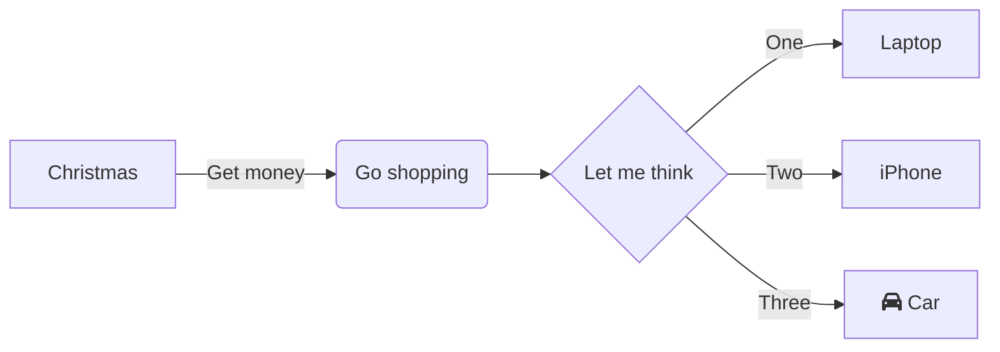

> [!info]
>
> 🌱 來自: [[markdown-lab]]

# mermaid 怎麼用

## [Use mermaid with code fences - tips & tricks - HUGO](https://discourse.gohugo.io/t/use-mermaid-with-code-fences/17211)

When using code fences syntax for mermaid code blocks, you’ll notice that Hugo turns this into <code class="language-mermaid">...</code>. Turns out it’s possible to tell mermaid which classes to look for when searching for graph definitions.



Simply add this at the end of your body:

```
{{ $mermaid := resources.Get "/path/to/mermaid.min.js" }}
<script src="{{ $mermaid.RelPermalink }}"></script>
<script>
    window.onload = function() {
        mermaid.init(undefined, ".language-mermaid");
    };
</script>
```

* [Adding Diagrams to Your Hugo Blog With Mermaid | Navendu Pottekkat](https://navendu.me/posts/adding-diagrams-to-your-hugo-blog-with-mermaid/)
* [使用Mermaid在hugo的Markdown中繪製UML · 零壹軒·筆記](https://note.qidong.name/2020/07/mermaid/)
* [Hugo部落格新增mermaid作圖 - 騰訊雲開發者社區-騰訊雲](https://cloud.tencent.com/developer/article/1944123)
[給 Hugo 部落格新增 mermaid 短程式碼支援 :: /dev/ttyS3 — 回首向來蕭瑟處 也無荒野也無燈](https://ttys3.dev/post/add-mermaid-shortcode-to-hugo/)
* [Add mermaid support to hugo code fences | anis](https://anis.se/posts/add-mermaidjs-support-to-hugo/)
* [Hugo code fences output two tags, pre and code - Stack Overflow](https://stackoverflow.com/questions/71123903/hugo-code-fences-output-two-tags-pre-and-code)
*

```js
// mermaid loader by ttys3.dev
const loadMermaidOnNeed = () => {
if (document.querySelectorAll('.mermaid').length > 0) {
	loadScript('https://cdn.jsdelivr.net/npm/mermaid@8.10.1/dist/mermaid.min.js', () => {
	document.head.insertAdjacentHTML("beforeend", `<style>.mermaid svg { background-color: #dadcd8 !important; }</style>`);
	// default, dark, neutral, forest
	mermaid.initialize({ startOnLoad: false, securityLevel: "strict", logLevel: 1, theme: "neutral" });
	// https://github.com/mermaid-js/mermaid/blob/e6e94ad57ea06ef8627bf91ddfbd88f5082952bf/src/mermaid.js#L153
	// mermaid.contentLoaded();
	mermaid.init();
	console.log("mermaid init done");
	})
	}
}
```
